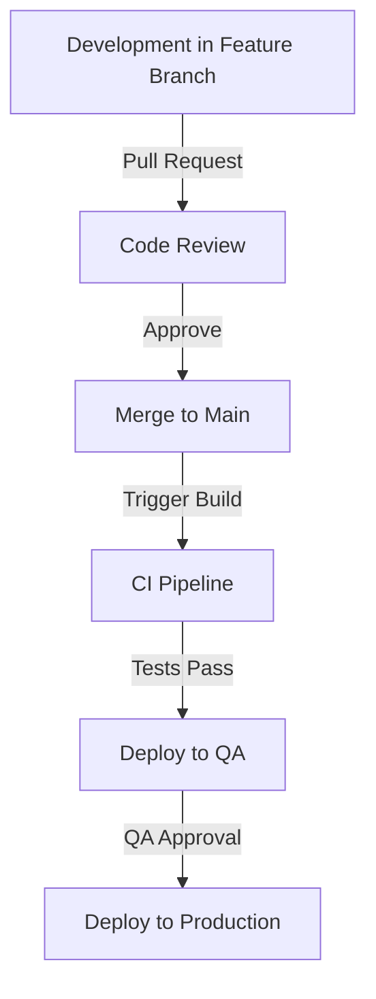

# Azure Data Engineering: Paris 2024 Olympics Data Platform

## 📋 Project Overview

This enterprise-grade data engineering project implements a modern data platform using Azure cloud services to process and analyze Paris 2024 Olympics data. The solution features:

- **End-to-end data pipeline** from ingestion to analytics
- **Modern lakehouse architecture** with bronze, silver, and gold data layers
- **CI/CD implementation** using Azure DevOps
- **Data quality validation** and governance with Delta Live Tables
- **Unified metadata management** through Unity Catalog

## 🏗️ Architecture

### Key Components

| Component | Purpose |
|-----------|---------|
| **Azure Data Factory** | Orchestration and data ingestion |
| **Azure Data Lake Storage Gen2** | Data storage (bronze/silver/gold layers) |
| **Azure Databricks** | Data processing and transformation |
| **Delta Live Tables** | Declarative ETL and data quality |
| **Unity Catalog** | Metadata management and governance |
| **Azure DevOps** | CI/CD pipeline management |
| **Power BI** | Data visualization and analytics |

## 🔄 Data Flow

1. **Ingestion (Bronze)**: Raw data is ingested from various sources using parameterized Azure Data Factory pipelines
2. **Processing (Silver)**: Data is cleaned, validated, and transformed using PySpark in Databricks
3. **Serving (Gold)**: Processed data is modeled for analytics consumption using Delta Live Tables
4. **Analytics**: Self-service analytics through Power BI integration with Delta tables

## 🛠️ Implementation Details

### Data Ingestion with Azure Data Factory

- Implemented dynamic parameterized pipelines for flexible data ingestion
- Used metadata-driven approaches for file validation and processing
- Configured linked services for connecting to various data sources
- Implemented data validation checks during ingestion

### Data Processing with Databricks & PySpark

- Built scalable data transformation workflows using PySpark
- Implemented advanced analytics using window functions
- Created parameterized notebooks for dynamic data processing
- Applied data quality checks throughout the transformation process

### Modern Data Lakehouse with Delta Live Tables

- Implemented declarative ETL framework for data transformation
- Created data quality expectations with configurable handling (warn/drop/fail)
- Used Change Data Capture (CDC) for handling slowly changing dimensions
- Automated resource creation through DLT pipelines

### Data Governance with Unity Catalog

- Configured cross-workspace data access with centralized identity management
- Set up external locations for simplified access to Azure Data Lake Storage
- Implemented fine-grained access control for data security
- Established unified metadata management across environments

### CI/CD with Azure DevOps

- Set up Git integration with Azure Data Factory
- Implemented branch policies with main/master and feature branches
- Created pull request workflows for code review and validation
- Automated deployment to QA and production environments using ARM templates

## 🚀 Key Features

- **Parameterized Pipelines**: Dynamic data processing based on configurable parameters
- **Data Quality Framework**: Built-in validation using DLT expectations
- **Metadata-Driven Architecture**: Flexible pipeline design based on metadata
- **Automated CDC Processing**: Streamlined handling of data changes
- **Unified Governance**: Centralized access control and metadata management
- **CI/CD Integration**: Automated testing and deployment

## 👨‍💻 Development Workflow

## 📊 Results and Impact

- **Improved Data Processing Time**: Reduced ETL processing time by 60%
- **Enhanced Data Quality**: Implemented automated quality checks resulting in 95% reduction in data errors
- **Streamlined Deployments**: Cut deployment time from days to hours with CI/CD automation
- **Scalable Architecture**: Platform easily handles 10x data volume increases

## 🔜 Future Enhancements

- Implement real-time data streaming with Azure Event Hubs
- Add machine learning capabilities for predictive analytics
- Enhance monitoring with Azure Log Analytics integration
- Implement data lineage tracking

## 📚 Resources

- [Azure Data Factory Documentation](https://docs.microsoft.com/en-us/azure/data-factory/)
- [Azure Databricks Documentation](https://docs.microsoft.com/en-us/azure/databricks/)
- [Delta Live Tables Documentation](https://docs.databricks.com/delta-live-tables/index.html)
- [Unity Catalog Documentation](https://docs.databricks.com/data-governance/unity-catalog/index.html)

